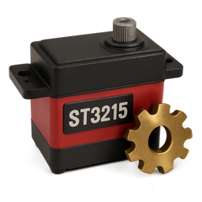

# Project summary

Python port of FT_SCServo_Debug_Qt, with the goal of being cross-platform.

It all started because I wanted to build a SO-101 robotic arm, from the 
[LeRobot project](https://github.com/huggingface/lerobot). This arm uses 
Feetech ST3215 servos, but the official configuration tool only runs on 
Windows, and I'm a Mac user. So I took the C++ source code from FT_SCServo_Debug_Qt
and ported it to Python. 

# Status of Development

The tool is actually only compatible with Feetech ST series (and possibly SC)
which is what I have to test.

All functionality works. Missing is the ability to save and load configurations
from file.

And the code is still pretty "unpolished". A lot of clean up is needed.

The current release is v0.1.0, which you can download as a binary for MacOS (Intel), 
Windows and Debian/Ubuntu [here](https://github.com/dgmz/feetech-servo-tool/releases/tag/v0.1.0). Other Debian based distros may work too. If it doesn't
try with the source code. Sorry for Apple hardware Macs, but I don't own one, so
no binary for now.

# Build Instructions

For Windows:

```CMD
git pull https://github.com/dgmz/feetech-servo-tool.git
cd feetech-servo-tool
python -m venv venv
venv\Scripts\activate
pip install -r requirements.txt
build-win
```

For MacOS:

```sh
git pull https://github.com/dgmz/feetech-servo-tool.git
cd feetech-servo-tool
python -m venv venv
source venv/bin/activate
pip install -r requirements.txt
sh build-mac.sh
```

For Linux:
```sh
git pull https://github.com/dgmz/feetech-servo-tool.git
cd feetech-servo-tool
python -m venv venv
source venv/bin/activate
pip install -r requirements.txt
sh build-linux.sh
```

A directory named `dist` will be created with the binary.
